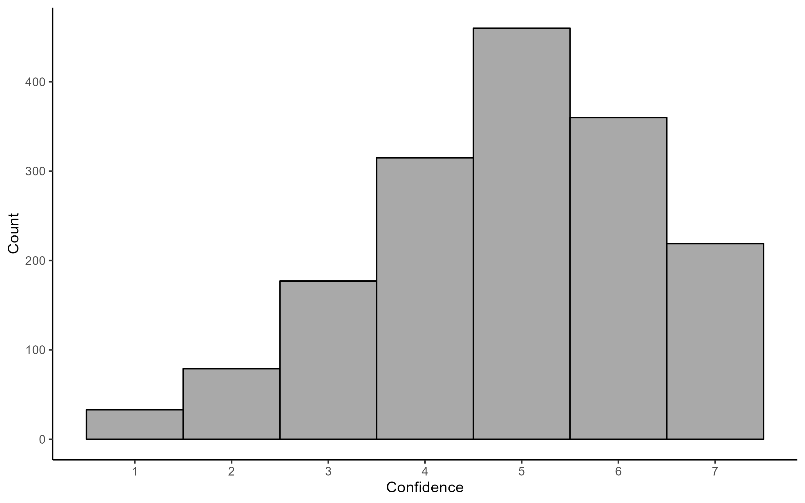
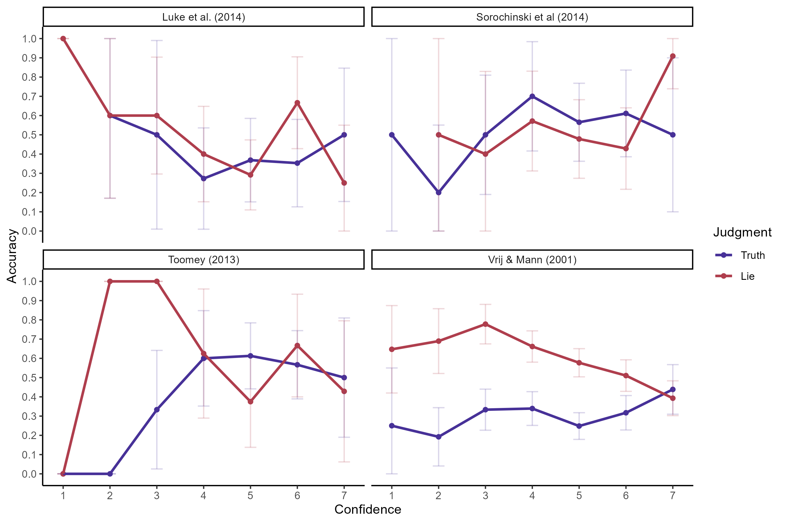

Does Confidence Predict Deception Detection Accuracy?
================

# Descriptives

## Accuracy Rates

``` r
accuracy_overall %>% 
  knitr::kable()
```

|  accuracy |
|----------:|
| 0.4698722 |

``` r
accuracy_veracity %>% 
  knitr::kable()
```

| veracity |  accuracy |
|:---------|----------:|
| lie      | 0.5015416 |
| truth    | 0.4238806 |

``` r
accuracy_study %>% 
  knitr::kable()
```

| study       |  accuracy |
|:------------|----------:|
| luke        | 0.4265734 |
| press_conf  | 0.4575000 |
| sorochinski | 0.5466667 |
| toomey      | 0.5333333 |

``` r
accuracy_study_veracity %>% 
  knitr::kable()
```

| study       | veracity |  accuracy |
|:------------|:---------|----------:|
| luke        | lie      | 0.4800000 |
| luke        | truth    | 0.3676471 |
| press_conf  | lie      | 0.5120000 |
| press_conf  | truth    | 0.3666667 |
| sorochinski | lie      | 0.5540541 |
| sorochinski | truth    | 0.5394737 |
| toomey      | lie      | 0.3648649 |
| toomey      | truth    | 0.6973684 |

``` r
accuracy_judgment %>% 
  knitr::kable()
```

| judgment |  accuracy |
|---------:|----------:|
|        0 | 0.3693108 |
|        1 | 0.5583524 |

``` r
sensitivity_table %>% 
  knitr::kable()
```

| mean_dprime | sd_dprime | median_dprime | min_dprime | max_dprime |
|------------:|----------:|--------------:|-----------:|-----------:|
|  -0.1996367 | 0.7491177 |    -0.2104284 |  -2.848228 |   1.911858 |

# Judgment Bias

``` r
judgment_bias %>% 
  knitr::kable()
```

| lie_judgment |
|-------------:|
|    0.5319537 |

``` r
judgment_bias_study %>% 
  knitr::kable()
```

| study       | lie_judgment |
|:------------|-------------:|
| luke        |    0.5524476 |
| press_conf  |    0.5575000 |
| sorochinski |    0.5066667 |
| toomey      |    0.3333333 |

``` r
bias_table %>% 
  knitr::kable()
```

| mean_beta |   sd_beta | median_beta |  min_beta | max_beta |
|----------:|----------:|------------:|----------:|---------:|
|   1.05596 | 0.3476433 |    1.011003 | 0.2957007 | 2.433473 |

# Confidence

``` r

```


``` r

```


``` r
confidence_table
```

    # A tibble: 14 × 6
    # Groups:   judgment [2]
       judgment confidence accuracy     se   ci_lb ci_ub
          <dbl>      <dbl>    <dbl>  <dbl>   <dbl> <dbl>
     1        0          1    0.25  0.125  0.00500 0.495
     2        0          2    0.231 0.0675 0.0985  0.363
     3        0          3    0.357 0.0484 0.262   0.452
     4        0          4    0.385 0.0400 0.307   0.464
     5        0          5    0.342 0.0318 0.280   0.405
     6        0          6    0.396 0.0376 0.323   0.470
     7        0          7    0.457 0.0553 0.348   0.565
     8        1          1    0.619 0.106  0.411   0.827
     9        1          2    0.7   0.0725 0.558   0.842
    10        1          3    0.734 0.0497 0.637   0.832
    11        1          4    0.629 0.0374 0.555   0.702
    12        1          5    0.525 0.0324 0.462   0.589
    13        1          6    0.524 0.0361 0.453   0.594
    14        1          7    0.428 0.0421 0.345   0.510

``` r

```


## By Study

``` r
confidence_study_table %>% 
  knitr::kable()
```

| study                    | judgment | confidence |  accuracy |        se |     ci_lb |     ci_ub |
|:-------------------------|---------:|-----------:|----------:|----------:|----------:|----------:|
| Luke et al. (2014)       |        0 |          2 | 0.6000000 | 0.2190890 | 0.1705934 | 1.0000000 |
| Luke et al. (2014)       |        0 |          3 | 0.5000000 | 0.2500000 | 0.0100090 | 0.9899910 |
| Luke et al. (2014)       |        0 |          4 | 0.2727273 | 0.1342816 | 0.0095401 | 0.5359144 |
| Luke et al. (2014)       |        0 |          5 | 0.3684211 | 0.1106647 | 0.1515222 | 0.5853199 |
| Luke et al. (2014)       |        0 |          6 | 0.3529412 | 0.1159040 | 0.1257734 | 0.5801089 |
| Luke et al. (2014)       |        0 |          7 | 0.5000000 | 0.1767767 | 0.1535240 | 0.8464760 |
| Luke et al. (2014)       |        1 |          1 | 1.0000000 | 0.0000000 | 1.0000000 | 1.0000000 |
| Luke et al. (2014)       |        1 |          2 | 0.6000000 | 0.2190890 | 0.1705934 | 1.0000000 |
| Luke et al. (2014)       |        1 |          3 | 0.6000000 | 0.1549193 | 0.2963637 | 0.9036363 |
| Luke et al. (2014)       |        1 |          4 | 0.4000000 | 0.1264911 | 0.1520820 | 0.6479180 |
| Luke et al. (2014)       |        1 |          5 | 0.2916667 | 0.0927805 | 0.1098203 | 0.4735131 |
| Luke et al. (2014)       |        1 |          6 | 0.6666667 | 0.1217161 | 0.4281074 | 0.9052259 |
| Luke et al. (2014)       |        1 |          7 | 0.2500000 | 0.1530931 | 0.0000000 | 0.5500570 |
| Vrij & Mann (2001)       |        0 |          1 | 0.2500000 | 0.1530931 | 0.0000000 | 0.5500570 |
| Vrij & Mann (2001)       |        0 |          2 | 0.1923077 | 0.0772920 | 0.0408181 | 0.3437973 |
| Vrij & Mann (2001)       |        0 |          3 | 0.3333333 | 0.0544331 | 0.2266464 | 0.4400203 |
| Vrij & Mann (2001)       |        0 |          4 | 0.3392857 | 0.0447384 | 0.2516000 | 0.4269714 |
| Vrij & Mann (2001)       |        0 |          5 | 0.2483221 | 0.0353941 | 0.1789511 | 0.3176932 |
| Vrij & Mann (2001)       |        0 |          6 | 0.3173077 | 0.0456390 | 0.2278569 | 0.4067585 |
| Vrij & Mann (2001)       |        0 |          7 | 0.4385965 | 0.0657253 | 0.3097772 | 0.5674158 |
| Vrij & Mann (2001)       |        1 |          1 | 0.6470588 | 0.1159040 | 0.4198911 | 0.8742266 |
| Vrij & Mann (2001)       |        1 |          2 | 0.6896552 | 0.0859091 | 0.5212764 | 0.8580339 |
| Vrij & Mann (2001)       |        1 |          3 | 0.7777778 | 0.0523783 | 0.6751182 | 0.8804373 |
| Vrij & Mann (2001)       |        1 |          4 | 0.6615385 | 0.0415012 | 0.5801976 | 0.7428793 |
| Vrij & Mann (2001)       |        1 |          5 | 0.5771429 | 0.0373439 | 0.5039502 | 0.6503355 |
| Vrij & Mann (2001)       |        1 |          6 | 0.5104895 | 0.0418029 | 0.4285573 | 0.5924217 |
| Vrij & Mann (2001)       |        1 |          7 | 0.3928571 | 0.0461481 | 0.3024085 | 0.4833057 |
| Sorochinski et al (2014) |        0 |          1 | 0.5000000 | 0.3535534 | 0.0000000 | 1.0000000 |
| Sorochinski et al (2014) |        0 |          2 | 0.2000000 | 0.1788854 | 0.0000000 | 0.5506090 |
| Sorochinski et al (2014) |        0 |          3 | 0.5000000 | 0.1581139 | 0.1901025 | 0.8098975 |
| Sorochinski et al (2014) |        0 |          4 | 0.7000000 | 0.1449138 | 0.4159742 | 0.9840258 |
| Sorochinski et al (2014) |        0 |          5 | 0.5652174 | 0.1033665 | 0.3626227 | 0.7678121 |
| Sorochinski et al (2014) |        0 |          6 | 0.6111111 | 0.1149044 | 0.3859027 | 0.8363196 |
| Sorochinski et al (2014) |        0 |          7 | 0.5000000 | 0.2041241 | 0.0999240 | 0.9000760 |
| Sorochinski et al (2014) |        1 |          2 | 0.5000000 | 0.3535534 | 0.0000000 | 1.0000000 |
| Sorochinski et al (2014) |        1 |          3 | 0.4000000 | 0.2190890 | 0.0000000 | 0.8294066 |
| Sorochinski et al (2014) |        1 |          4 | 0.5714286 | 0.1322600 | 0.3122037 | 0.8306534 |
| Sorochinski et al (2014) |        1 |          5 | 0.4782609 | 0.1041586 | 0.2741137 | 0.6824080 |
| Sorochinski et al (2014) |        1 |          6 | 0.4285714 | 0.1079898 | 0.2169152 | 0.6402276 |
| Sorochinski et al (2014) |        1 |          7 | 0.9090909 | 0.0866784 | 0.7392043 | 1.0000000 |
| Toomey (2013)            |        0 |          1 | 0.0000000 | 0.0000000 | 0.0000000 | 0.0000000 |
| Toomey (2013)            |        0 |          2 | 0.0000000 | 0.0000000 | 0.0000000 | 0.0000000 |
| Toomey (2013)            |        0 |          3 | 0.3333333 | 0.1571348 | 0.0253547 | 0.6413120 |
| Toomey (2013)            |        0 |          4 | 0.6000000 | 0.1264911 | 0.3520820 | 0.8479180 |
| Toomey (2013)            |        0 |          5 | 0.6129032 | 0.0874832 | 0.4414392 | 0.7843672 |
| Toomey (2013)            |        0 |          6 | 0.5666667 | 0.0904720 | 0.3893448 | 0.7439886 |
| Toomey (2013)            |        0 |          7 | 0.5000000 | 0.1581139 | 0.1901025 | 0.8098975 |
| Toomey (2013)            |        1 |          1 | 0.0000000 | 0.0000000 | 0.0000000 | 0.0000000 |
| Toomey (2013)            |        1 |          2 | 1.0000000 | 0.0000000 | 1.0000000 | 1.0000000 |
| Toomey (2013)            |        1 |          3 | 1.0000000 | 0.0000000 | 1.0000000 | 1.0000000 |
| Toomey (2013)            |        1 |          4 | 0.6250000 | 0.1711633 | 0.2895261 | 0.9604739 |
| Toomey (2013)            |        1 |          5 | 0.3750000 | 0.1210307 | 0.1377841 | 0.6122159 |
| Toomey (2013)            |        1 |          6 | 0.6666667 | 0.1360828 | 0.3999494 | 0.9333840 |
| Toomey (2013)            |        1 |          7 | 0.4285714 | 0.1870439 | 0.0619721 | 0.7951707 |

``` r

```


## By Sender Detectability

``` r
knitr::include_graphics("./figures/confidence_detectability_plot.png")
```


# Hypothesis 1: General Confidence-Accuracy Relationship

*Confidence predicts deception detection accuracy, such that more
confident judgments are more accurate.*

There is no significant overall relationship between confidence and
accuracy.

``` r
summary(glmer_h1)
```

    Generalized linear mixed model fit by maximum likelihood (Laplace
      Approximation) [glmerMod]
     Family: binomial  ( logit )
    Formula: accuracy ~ 1 + confidence_centered + (1 | study:sender) + (1 |  
        sender) + (1 | receiver)
       Data: judgment
    Control: glmerControl(optimizer = "bobyqa", optCtrl = list(maxfun = 1e+05))

         AIC      BIC   logLik deviance df.resid 
      2174.2   2201.3  -1082.1   2164.2     1638 

    Scaled residuals: 
        Min      1Q  Median      3Q     Max 
    -1.4774 -0.9385 -0.4134  0.8933  2.5103 

    Random effects:
     Groups       Name        Variance Std.Dev.
     receiver     (Intercept) 0.04279  0.2069  
     sender       (Intercept) 0.29233  0.5407  
     study:sender (Intercept) 0.17233  0.4151  
    Number of obs: 1643, groups:  receiver, 150; sender, 67; study:sender, 67

    Fixed effects:
                        Estimate Std. Error z value Pr(>|z|)
    (Intercept)         -0.02867    0.11967  -0.240    0.811
    confidence_centered -0.02334    0.03755  -0.621    0.534

    Correlation of Fixed Effects:
                (Intr)
    cnfdnc_cntr -0.010
    optimizer (bobyqa) convergence code: 0 (OK)
    Model is nearly unidentifiable: large eigenvalue ratio
     - Rescale variables?

# Hypothesis 2: Signal-Present Judgment Specificity

*Confidence predicts deception detection accuracy, such that more
confident judgments are more accurate, to a greater extent for lie
judgments than truth judgments.*

For truth judgments, confidence is somewhat predictive of accuracy, but
for lie judgments, confidence negatively predicts accuracy. That is, for
lie judgments, people are less accurate when they are more confident.

``` r
lrt_h2
```

    Data: judgment
    Models:
    glmer_h2_base: accuracy ~ 1 + confidence_centered + judgment + (1 | study:sender) + (1 | sender) + (1 | receiver)
    glmer_h2_interaction: accuracy ~ 1 + confidence_centered * judgment + (1 | study:sender) + (1 | sender) + (1 | receiver)
                         npar    AIC    BIC  logLik deviance  Chisq Df Pr(>Chisq)
    glmer_h2_base           6 2069.2 2101.7 -1028.6   2057.2                     
    glmer_h2_interaction    7 2058.4 2096.3 -1022.2   2044.5 12.776  1  0.0003511
                            
    glmer_h2_base           
    glmer_h2_interaction ***
    ---
    Signif. codes:  0 '***' 0.001 '**' 0.01 '*' 0.05 '.' 0.1 ' ' 1

``` r
summary(glmer_h2_base)
```

    Generalized linear mixed model fit by maximum likelihood (Laplace
      Approximation) [glmerMod]
     Family: binomial  ( logit )
    Formula: accuracy ~ 1 + confidence_centered + judgment + (1 | study:sender) +  
        (1 | sender) + (1 | receiver)
       Data: judgment
    Control: glmerControl(optimizer = "bobyqa", optCtrl = list(maxfun = 1e+05))

         AIC      BIC   logLik deviance df.resid 
      2069.2   2101.6  -1028.6   2057.2     1637 

    Scaled residuals: 
        Min      1Q  Median      3Q     Max 
    -2.4622 -0.7840 -0.4313  0.7443  4.2128 

    Random effects:
     Groups       Name        Variance Std.Dev.
     receiver     (Intercept) 0.007447 0.08629 
     sender       (Intercept) 0.417382 0.64605 
     study:sender (Intercept) 0.315142 0.56137 
    Number of obs: 1643, groups:  receiver, 150; sender, 67; study:sender, 67

    Fixed effects:
                        Estimate Std. Error z value Pr(>|z|)    
    (Intercept)         -0.58381    0.14819  -3.940 8.16e-05 ***
    confidence_centered -0.03506    0.03849  -0.911    0.362    
    judgment             1.16863    0.11640  10.040  < 2e-16 ***
    ---
    Signif. codes:  0 '***' 0.001 '**' 0.01 '*' 0.05 '.' 0.1 ' ' 1

    Correlation of Fixed Effects:
                (Intr) cnfdn_
    cnfdnc_cntr  0.008       
    judgment    -0.370 -0.044
    optimizer (bobyqa) convergence code: 0 (OK)
    Model is nearly unidentifiable: large eigenvalue ratio
     - Rescale variables?

``` r
summary(glmer_h2_interaction)
```

    Generalized linear mixed model fit by maximum likelihood (Laplace
      Approximation) [glmerMod]
     Family: binomial  ( logit )
    Formula: accuracy ~ 1 + confidence_centered * judgment + (1 | study:sender) +  
        (1 | sender) + (1 | receiver)
       Data: judgment
    Control: glmerControl(optimizer = "bobyqa", optCtrl = list(maxfun = 1e+05))

         AIC      BIC   logLik deviance df.resid 
      2058.4   2096.3  -1022.2   2044.4     1636 

    Scaled residuals: 
        Min      1Q  Median      3Q     Max 
    -2.4893 -0.7771 -0.4132  0.7504  4.7436 

    Random effects:
     Groups       Name        Variance Std.Dev.
     receiver     (Intercept) 0.02244  0.1498  
     sender       (Intercept) 0.37744  0.6144  
     study:sender (Intercept) 0.35161  0.5930  
    Number of obs: 1643, groups:  receiver, 150; sender, 67; study:sender, 67

    Fixed effects:
                                 Estimate Std. Error z value Pr(>|z|)    
    (Intercept)                  -0.57128    0.14854  -3.846 0.000120 ***
    confidence_centered           0.11494    0.05772   1.992 0.046425 *  
    judgment                      1.15165    0.11688   9.854  < 2e-16 ***
    confidence_centered:judgment -0.27890    0.07892  -3.534 0.000409 ***
    ---
    Signif. codes:  0 '***' 0.001 '**' 0.01 '*' 0.05 '.' 0.1 ' ' 1

    Correlation of Fixed Effects:
                (Intr) cnfdn_ jdgmnt
    cnfdnc_cntr  0.007              
    judgment    -0.371 -0.037       
    cnfdnc_cnt: -0.013 -0.731  0.012
    optimizer (bobyqa) convergence code: 0 (OK)
    Model is nearly unidentifiable: large eigenvalue ratio
     - Rescale variables?

# Hypothesis 3: Variation Across Senders

*Confidence predicts deception detection accuracy, such that more
confident judgments are more accurate, possibly to a greater extent for
lie judgments than truth judgments, and this tendency varies in
magnitude across senders.*

Model failed to converge. Do not interpret.

``` r
lrt_h3
```

    Data: judgment
    Models:
    glmer_h2_interaction: accuracy ~ 1 + confidence_centered * judgment + (1 | study:sender) + (1 | sender) + (1 | receiver)
    glmer_h3_base: accuracy ~ 1 + confidence_centered * judgment + (1 | study:sender) + (1 + confidence_centered + judgment | sender) + (1 | receiver)
    glmer_h3_interaction: accuracy ~ 1 + confidence_centered * judgment + (1 | study:sender) + (1 + confidence_centered + judgment + confidence_centered:judgment | sender) + (1 | receiver)
                         npar     AIC     BIC   logLik deviance  Chisq Df
    glmer_h2_interaction    7 2058.45 2096.28 -1022.22  2044.45          
    glmer_h3_base          12  127.61  192.46   -51.80   103.61 1940.8  5
    glmer_h3_interaction   16  159.49  245.96   -63.74   127.49    0.0  4
                         Pr(>Chisq)    
    glmer_h2_interaction               
    glmer_h3_base            <2e-16 ***
    glmer_h3_interaction          1    
    ---
    Signif. codes:  0 '***' 0.001 '**' 0.01 '*' 0.05 '.' 0.1 ' ' 1

``` r
summary(glmer_h3_base)
```

    Generalized linear mixed model fit by maximum likelihood (Laplace
      Approximation) [glmerMod]
     Family: binomial  ( logit )
    Formula: accuracy ~ 1 + confidence_centered * judgment + (1 | study:sender) +  
        (1 + confidence_centered + judgment | sender) + (1 | receiver)
       Data: judgment
    Control: glmerControl(optimizer = "bobyqa", optCtrl = list(maxfun = 1e+05))

         AIC      BIC   logLik deviance df.resid 
       127.6    192.5    -51.8    103.6     1631 

    Scaled residuals: 
          Min        1Q    Median        3Q       Max 
    -0.012769 -0.001234 -0.000003  0.000281  0.152725 

    Random effects:
     Groups       Name                Variance  Std.Dev.  Corr       
     receiver     (Intercept)         4.671e-07 6.835e-04            
     sender       (Intercept)         1.228e+03 3.504e+01            
                  confidence_centered 2.703e+01 5.199e+00 -1.00      
                  judgment            9.994e+03 9.997e+01 -0.98  0.98
     study:sender (Intercept)         6.522e+00 2.554e+00            
    Number of obs: 1643, groups:  receiver, 150; sender, 67; study:sender, 67

    Fixed effects:
                                   Estimate Std. Error z value Pr(>|z|)    
    (Intercept)                  -11.442714   0.001234 -9269.4   <2e-16 ***
    confidence_centered            0.925775   0.001235   749.6   <2e-16 ***
    judgment                      27.764384   0.001234 22500.5   <2e-16 ***
    confidence_centered:judgment   0.169340   0.001234   137.3   <2e-16 ***
    ---
    Signif. codes:  0 '***' 0.001 '**' 0.01 '*' 0.05 '.' 0.1 ' ' 1

    Correlation of Fixed Effects:
                (Intr) cnfdn_ jdgmnt
    cnfdnc_cntr 0.001               
    judgment    0.000  0.000        
    cnfdnc_cnt: 0.000  0.000  0.000 
    optimizer (bobyqa) convergence code: 0 (OK)
    Model failed to converge with max|grad| = 0.0592429 (tol = 0.002, component 1)
    Model is nearly unidentifiable: very large eigenvalue
     - Rescale variables?
    Model is nearly unidentifiable: large eigenvalue ratio
     - Rescale variables?

``` r
summary(glmer_h3_interaction)
```

    Generalized linear mixed model fit by maximum likelihood (Laplace
      Approximation) [glmerMod]
     Family: binomial  ( logit )
    Formula: accuracy ~ 1 + confidence_centered * judgment + (1 | study:sender) +  
        (1 + confidence_centered + judgment + confidence_centered:judgment |  
            sender) + (1 | receiver)
       Data: judgment
    Control: glmerControl(optimizer = "bobyqa", optCtrl = list(maxfun = 1e+05))

         AIC      BIC   logLik deviance df.resid 
       159.5    246.0    -63.7    127.5     1627 

    Scaled residuals: 
         Min       1Q   Median       3Q      Max 
    -0.39992 -0.00002  0.00000  0.00044  0.31414 

    Random effects:
     Groups       Name                         Variance  Std.Dev. Corr             
     receiver     (Intercept)                  2.892e-04  0.01701                  
     sender       (Intercept)                  3.262e+03 57.11318                  
                  confidence_centered          3.464e+00  1.86109 -1.00            
                  judgment                     6.423e+03 80.14380 -1.00  1.00      
                  confidence_centered:judgment 9.663e+00  3.10852 -1.00  1.00  1.00
     study:sender (Intercept)                  6.096e-04  0.02469                  
    Number of obs: 1643, groups:  receiver, 150; sender, 67; study:sender, 67

    Fixed effects:
                                   Estimate Std. Error z value Pr(>|z|)    
    (Intercept)                  -1.9610482  0.0007652 -2562.8   <2e-16 ***
    confidence_centered           0.1046106  0.0007652   136.7   <2e-16 ***
    judgment                      3.6843555  0.0007652  4815.1   <2e-16 ***
    confidence_centered:judgment  0.0992634  0.0007652   129.7   <2e-16 ***
    ---
    Signif. codes:  0 '***' 0.001 '**' 0.01 '*' 0.05 '.' 0.1 ' ' 1

    Correlation of Fixed Effects:
                (Intr) cnfdn_ jdgmnt
    cnfdnc_cntr 0.000               
    judgment    0.000  0.000        
    cnfdnc_cnt: 0.000  0.000  0.000 
    optimizer (bobyqa) convergence code: 0 (OK)
    unable to evaluate scaled gradient
    Model failed to converge: degenerate  Hessian with 1 negative eigenvalues

# Hypothesis 4: Variation Across Contexts

*Confidence predicts deception detection accuracy, such that more
confident judgments are more accurate, possibly to a greater extent for
lie judgments than truth judgments, and this tendency varies in
magnitude across contexts.*

Model failed to converge. Do not interpret.

``` r
lrt_h4
```

    Data: judgment
    Models:
    glmer_h2_interaction: accuracy ~ 1 + confidence_centered * judgment + (1 | study:sender) + (1 | sender) + (1 | receiver)
    glmer_h4_base: accuracy ~ 1 + confidence_centered * judgment + (1 + confidence_centered + judgment | study:sender) + (1 | sender) + (1 | receiver)
    glmer_h4_interaction: accuracy ~ 1 + confidence_centered * judgment + (1 + confidence_centered + judgment + confidence_centered:judgment | study:sender) + (1 | sender) + (1 | receiver)
                         npar     AIC     BIC   logLik deviance    Chisq Df
    glmer_h2_interaction    7 2058.45 2096.28 -1022.22  2044.45            
    glmer_h4_base          12  144.45  209.30   -60.23   120.45 1923.994  5
    glmer_h4_interaction   16  134.66  221.13   -51.33   102.66   17.789  4
                         Pr(>Chisq)    
    glmer_h2_interaction               
    glmer_h4_base         < 2.2e-16 ***
    glmer_h4_interaction   0.001357 ** 
    ---
    Signif. codes:  0 '***' 0.001 '**' 0.01 '*' 0.05 '.' 0.1 ' ' 1

``` r
summary(glmer_h4_base)
```

    Generalized linear mixed model fit by maximum likelihood (Laplace
      Approximation) [glmerMod]
     Family: binomial  ( logit )
    Formula: 
    accuracy ~ 1 + confidence_centered * judgment + (1 + confidence_centered +  
        judgment | study:sender) + (1 | sender) + (1 | receiver)
       Data: judgment
    Control: glmerControl(optimizer = "bobyqa", optCtrl = list(maxfun = 1e+05))

         AIC      BIC   logLik deviance df.resid 
       144.5    209.3    -60.2    120.5     1631 

    Scaled residuals: 
         Min       1Q   Median       3Q      Max 
    -0.18458 -0.00005  0.00000  0.00000  0.34073 

    Random effects:
     Groups       Name                Variance  Std.Dev.  Corr       
     receiver     (Intercept)         4.823e-06 2.196e-03            
     sender       (Intercept)         6.934e-07 8.327e-04            
     study:sender (Intercept)         5.244e+02 2.290e+01            
                  confidence_centered 5.933e+01 7.702e+00 -1.00      
                  judgment            8.064e+03 8.980e+01 -0.95  0.95
    Number of obs: 1643, groups:  receiver, 150; sender, 67; study:sender, 67

    Fixed effects:
                                   Estimate Std. Error z value Pr(>|z|)    
    (Intercept)                  -5.0459975  0.0007160   -7047   <2e-16 ***
    confidence_centered           1.3955894  0.0007161    1949   <2e-16 ***
    judgment                     11.8637729  0.0007159   16571   <2e-16 ***
    confidence_centered:judgment -1.2611445  0.0007160   -1761   <2e-16 ***
    ---
    Signif. codes:  0 '***' 0.001 '**' 0.01 '*' 0.05 '.' 0.1 ' ' 1

    Correlation of Fixed Effects:
                (Intr) cnfdn_ jdgmnt
    cnfdnc_cntr -0.006              
    judgment     0.005 -0.005       
    cnfdnc_cnt:  0.006 -0.006  0.006
    optimizer (bobyqa) convergence code: 0 (OK)
    Model failed to converge with max|grad| = 0.103935 (tol = 0.002, component 1)
    Model is nearly unidentifiable: very large eigenvalue
     - Rescale variables?
    Model is nearly unidentifiable: large eigenvalue ratio
     - Rescale variables?

``` r
summary(glmer_h4_interaction)
```

    Generalized linear mixed model fit by maximum likelihood (Laplace
      Approximation) [glmerMod]
     Family: binomial  ( logit )
    Formula: 
    accuracy ~ 1 + confidence_centered * judgment + (1 + confidence_centered +  
        judgment + confidence_centered:judgment | study:sender) +  
        (1 | sender) + (1 | receiver)
       Data: judgment
    Control: glmerControl(optimizer = "bobyqa", optCtrl = list(maxfun = 1e+05))

         AIC      BIC   logLik deviance df.resid 
       134.7    221.1    -51.3    102.7     1627 

    Scaled residuals: 
          Min        1Q    Median        3Q       Max 
    -0.012010 -0.001435  0.000000  0.000284  0.175914 

    Random effects:
     Groups       Name                         Variance  Std.Dev.  Corr       
     receiver     (Intercept)                  3.031e-08 1.741e-04            
     sender       (Intercept)                  2.974e-06 1.724e-03            
     study:sender (Intercept)                  1.977e+03 4.447e+01            
                  confidence_centered          3.807e+01 6.170e+00  1.00      
                  judgment                     1.345e+04 1.160e+02 -1.00 -1.00
                  confidence_centered:judgment 4.385e+01 6.622e+00 -0.71 -0.71
          
          
          
          
          
          
      0.69
    Number of obs: 1643, groups:  receiver, 150; sender, 67; study:sender, 67

    Fixed effects:
                                   Estimate Std. Error z value Pr(>|z|)    
    (Intercept)                  -12.184208   0.001295 -9408.3   <2e-16 ***
    confidence_centered           -0.726563   0.001309  -554.9   <2e-16 ***
    judgment                      27.716731   0.001289 21506.1   <2e-16 ***
    confidence_centered:judgment   0.545988   0.001287   424.3   <2e-16 ***
    ---
    Signif. codes:  0 '***' 0.001 '**' 0.01 '*' 0.05 '.' 0.1 ' ' 1

    Correlation of Fixed Effects:
                (Intr) cnfdn_ jdgmnt
    cnfdnc_cntr -0.006              
    judgment     0.002 -0.002       
    cnfdnc_cnt:  0.000  0.000  0.000
    optimizer (bobyqa) convergence code: 0 (OK)
    unable to evaluate scaled gradient
    Model failed to converge: degenerate  Hessian with 1 negative eigenvalues

# Hypothesis 5: Variation Across Receivers

*Confidence predicts deception detection accuracy, such that more
confident judgments are more accurate, possibly to a greater extent for
lie judgments than truth judgments, and this tendency varies in
magnitude across receivers.*

As one would expect from past literature, receivers vary extremely
little in their ability to detect deception, and there is no evidence
that receivers vary in their confidence-accuracy calibration.

``` r
lrt_h5
```

    Data: judgment
    Models:
    glmer_h2_interaction: accuracy ~ 1 + confidence_centered * judgment + (1 | study:sender) + (1 | sender) + (1 | receiver)
    glmer_h5_base: accuracy ~ 1 + confidence_centered * judgment + (1 | study:sender) + (1 | sender) + (1 + confidence_centered + judgment | receiver)
    glmer_h5_interaction: accuracy ~ 1 + confidence_centered * judgment + (1 | study:sender) + (1 | sender) + (1 + confidence_centered + judgment + confidence_centered:judgment | receiver)
                         npar    AIC    BIC  logLik deviance  Chisq Df Pr(>Chisq)
    glmer_h2_interaction    7 2058.4 2096.3 -1022.2   2044.5                     
    glmer_h5_base          12 2068.4 2133.3 -1022.2   2044.4 0.0233  5          1
    glmer_h5_interaction   16 2076.4 2162.9 -1022.2   2044.4 0.0181  4          1

``` r
summary(glmer_h5_base)
```

    Generalized linear mixed model fit by maximum likelihood (Laplace
      Approximation) [glmerMod]
     Family: binomial  ( logit )
    Formula: accuracy ~ 1 + confidence_centered * judgment + (1 | study:sender) +  
        (1 | sender) + (1 + confidence_centered + judgment | receiver)
       Data: judgment
    Control: glmerControl(optimizer = "bobyqa", optCtrl = list(maxfun = 1e+05))

         AIC      BIC   logLik deviance df.resid 
      2068.4   2133.3  -1022.2   2044.4     1631 

    Scaled residuals: 
        Min      1Q  Median      3Q     Max 
    -2.4804 -0.7786 -0.4135  0.7495  4.6852 

    Random effects:
     Groups       Name                Variance  Std.Dev. Corr       
     receiver     (Intercept)         0.0262373 0.16198             
                  confidence_centered 0.0001842 0.01357  -1.00      
                  judgment            0.0002303 0.01518  -1.00  1.00
     sender       (Intercept)         0.3939081 0.62762             
     study:sender (Intercept)         0.3342627 0.57815             
    Number of obs: 1643, groups:  receiver, 150; sender, 67; study:sender, 67

    Fixed effects:
                                 Estimate Std. Error z value Pr(>|z|)    
    (Intercept)                  -0.57214    0.14871  -3.847 0.000119 ***
    confidence_centered           0.11515    0.05790   1.989 0.046741 *  
    judgment                      1.15321    0.11767   9.800  < 2e-16 ***
    confidence_centered:judgment -0.28022    0.07994  -3.505 0.000456 ***
    ---
    Signif. codes:  0 '***' 0.001 '**' 0.01 '*' 0.05 '.' 0.1 ' ' 1

    Correlation of Fixed Effects:
                (Intr) cnfdn_ jdgmnt
    cnfdnc_cntr  0.003              
    judgment    -0.373 -0.034       
    cnfdnc_cnt: -0.007 -0.722 -0.008
    optimizer (bobyqa) convergence code: 0 (OK)
    boundary (singular) fit: see help('isSingular')

``` r
summary(glmer_h5_interaction)
```

    Generalized linear mixed model fit by maximum likelihood (Laplace
      Approximation) [glmerMod]
     Family: binomial  ( logit )
    Formula: accuracy ~ 1 + confidence_centered * judgment + (1 | study:sender) +  
        (1 | sender) + (1 + confidence_centered + judgment + confidence_centered:judgment |  
        receiver)
       Data: judgment
    Control: glmerControl(optimizer = "bobyqa", optCtrl = list(maxfun = 1e+05))

         AIC      BIC   logLik deviance df.resid 
      2076.4   2162.9  -1022.2   2044.4     1627 

    Scaled residuals: 
        Min      1Q  Median      3Q     Max 
    -2.4817 -0.7778 -0.4138  0.7502  4.7215 

    Random effects:
     Groups       Name                         Variance  Std.Dev. Corr             
     receiver     (Intercept)                  2.728e-02 0.165159                  
                  confidence_centered          5.221e-06 0.002285 -1.00            
                  judgment                     2.099e-04 0.014489 -1.00  1.00      
                  confidence_centered:judgment 2.548e-04 0.015963 -1.00  1.00  1.00
     sender       (Intercept)                  3.553e-01 0.596064                  
     study:sender (Intercept)                  3.730e-01 0.610713                  
    Number of obs: 1643, groups:  receiver, 150; sender, 67; study:sender, 67

    Fixed effects:
                                 Estimate Std. Error z value Pr(>|z|)    
    (Intercept)                  -0.57197    0.14874  -3.845 0.000120 ***
    confidence_centered           0.11496    0.05787   1.987 0.046972 *  
    judgment                      1.15321    0.11771   9.797  < 2e-16 ***
    confidence_centered:judgment -0.28045    0.08004  -3.504 0.000459 ***
    ---
    Signif. codes:  0 '***' 0.001 '**' 0.01 '*' 0.05 '.' 0.1 ' ' 1

    Correlation of Fixed Effects:
                (Intr) cnfdn_ jdgmnt
    cnfdnc_cntr  0.006              
    judgment    -0.372 -0.037       
    cnfdnc_cnt: -0.009 -0.719 -0.008
    optimizer (bobyqa) convergence code: 0 (OK)
    boundary (singular) fit: see help('isSingular')

# Hypothesis 6: Detectable Context Specificity

*Confidence predicts deception detection accuracy, such that more
confident judgments are more accurate, to a greater extent for lie
judgments than truth judgments, specifically in situations in which
judgments tend to be more accurate.*

Contrary to this hypothesis, confidence for lie judgments was negatively
associated with accuracy in contexts where accuracy was lower and not
significantly associated with accuracy in contexts where accuracy was
higher. Confidence for truth judgments was positively associated with
accuracy in contexts where accuracy was higher.

``` r
lrt_h6
```

    Data: judgment
    Models:
    glmer_h2_interaction: accuracy ~ 1 + confidence_centered * judgment + (1 | study:sender) + (1 | sender) + (1 | receiver)
    glmer_h6_base: accuracy ~ 1 + confidence_centered * judgment + detectability_study_centered + (1 | study:sender) + (1 | sender) + (1 | receiver)
    glmer_h6_interaction: accuracy ~ 1 + confidence_centered * judgment * detectability_study_centered + (1 | study:sender) + (1 | sender) + (1 | receiver)
                         npar    AIC    BIC  logLik deviance   Chisq Df Pr(>Chisq)
    glmer_h2_interaction    7 2058.4 2096.3 -1022.2   2044.5                      
    glmer_h6_base           8 2054.6 2097.9 -1019.3   2038.6  5.8147  1  0.0158930
    glmer_h6_interaction   11 2042.3 2101.8 -1010.2   2020.3 18.3103  3  0.0003796
                            
    glmer_h2_interaction    
    glmer_h6_base        *  
    glmer_h6_interaction ***
    ---
    Signif. codes:  0 '***' 0.001 '**' 0.01 '*' 0.05 '.' 0.1 ' ' 1

``` r
summary(glmer_h6_base)
```

    Generalized linear mixed model fit by maximum likelihood (Laplace
      Approximation) [glmerMod]
     Family: binomial  ( logit )
    Formula: 
    accuracy ~ 1 + confidence_centered * judgment + detectability_study_centered +  
        (1 | study:sender) + (1 | sender) + (1 | receiver)
       Data: judgment
    Control: glmerControl(optimizer = "bobyqa", optCtrl = list(maxfun = 1e+05))

         AIC      BIC   logLik deviance df.resid 
      2054.6   2097.9  -1019.3   2038.6     1635 

    Scaled residuals: 
        Min      1Q  Median      3Q     Max 
    -2.5474 -0.7757 -0.4133  0.7539  4.7336 

    Random effects:
     Groups       Name        Variance Std.Dev.
     receiver     (Intercept) 0.02509  0.1584  
     sender       (Intercept) 0.33048  0.5749  
     study:sender (Intercept) 0.29327  0.5415  
    Number of obs: 1643, groups:  receiver, 150; sender, 67; study:sender, 67

    Fixed effects:
                                 Estimate Std. Error z value Pr(>|z|)    
    (Intercept)                  -0.59548    0.14327  -4.156 3.24e-05 ***
    confidence_centered           0.11528    0.05772   1.997 0.045800 *  
    judgment                      1.15865    0.11677   9.923  < 2e-16 ***
    detectability_study_centered  6.32442    2.57634   2.455 0.014096 *  
    confidence_centered:judgment -0.28361    0.07891  -3.594 0.000325 ***
    ---
    Signif. codes:  0 '***' 0.001 '**' 0.01 '*' 0.05 '.' 0.1 ' ' 1

    Correlation of Fixed Effects:
                (Intr) cnfdn_ jdgmnt dtct__
    cnfdnc_cntr  0.008                     
    judgment    -0.393 -0.036              
    dtctblty_s_ -0.076  0.005  0.071       
    cnfdnc_cnt: -0.011 -0.730  0.011 -0.030
    optimizer (bobyqa) convergence code: 0 (OK)
    unable to evaluate scaled gradient
    Model failed to converge: degenerate  Hessian with 1 negative eigenvalues

``` r
summary(glmer_h6_interaction)
```

    Generalized linear mixed model fit by maximum likelihood (Laplace
      Approximation) [glmerMod]
     Family: binomial  ( logit )
    Formula: 
    accuracy ~ 1 + confidence_centered * judgment * detectability_study_centered +  
        (1 | study:sender) + (1 | sender) + (1 | receiver)
       Data: judgment
    Control: glmerControl(optimizer = "bobyqa", optCtrl = list(maxfun = 1e+05))

         AIC      BIC   logLik deviance df.resid 
      2042.3   2101.8  -1010.2   2020.3     1632 

    Scaled residuals: 
        Min      1Q  Median      3Q     Max 
    -2.5129 -0.7643 -0.4150  0.7456  4.8137 

    Random effects:
     Groups       Name        Variance Std.Dev.
     receiver     (Intercept) 0.02177  0.1475  
     sender       (Intercept) 0.27063  0.5202  
     study:sender (Intercept) 0.33907  0.5823  
    Number of obs: 1643, groups:  receiver, 150; sender, 67; study:sender, 67

    Fixed effects:
                                                               Estimate Std. Error
    (Intercept)                                                -0.51521    0.14478
    confidence_centered                                         0.15038    0.06471
    judgment                                                    0.87009    0.13495
    detectability_study_centered                               12.53097    3.04883
    confidence_centered:judgment                               -0.24176    0.09423
    confidence_centered:detectability_study_centered            1.88756    1.60504
    judgment:detectability_study_centered                     -13.23034    3.33315
    confidence_centered:judgment:detectability_study_centered   0.76850    2.35608
                                                              z value Pr(>|z|)    
    (Intercept)                                                -3.559 0.000373 ***
    confidence_centered                                         2.324 0.020134 *  
    judgment                                                    6.448 1.14e-10 ***
    detectability_study_centered                                4.110 3.96e-05 ***
    confidence_centered:judgment                               -2.566 0.010296 *  
    confidence_centered:detectability_study_centered            1.176 0.239588    
    judgment:detectability_study_centered                      -3.969 7.21e-05 ***
    confidence_centered:judgment:detectability_study_centered   0.326 0.744291    
    ---
    Signif. codes:  0 '***' 0.001 '**' 0.01 '*' 0.05 '.' 0.1 ' ' 1

    Correlation of Fixed Effects:
                (Intr) cnfdn_ jdgmnt dtct__ cnfd_: cn_:__ jdg:__
    cnfdnc_cntr  0.022                                          
    judgment    -0.419 -0.044                                   
    dtctblty_s_ -0.001  0.017 -0.217                            
    cnfdnc_cnt: -0.024 -0.684 -0.029 -0.011                     
    cnfdnc_c:__  0.012  0.436 -0.016  0.022 -0.301              
    jdgmnt:dt__ -0.144 -0.024  0.498 -0.539 -0.041 -0.036       
    cnfdnc_::__ -0.022 -0.296 -0.048 -0.008  0.530 -0.684 -0.035
    optimizer (bobyqa) convergence code: 0 (OK)
    unable to evaluate scaled gradient
    Model failed to converge: degenerate  Hessian with 1 negative eigenvalues

``` r
interactions_h6
```

    █████████████████████ While judgment (2nd moderator) = 1.00 ████████████████████ 

    JOHNSON-NEYMAN INTERVAL 

    When detectability_study_centered is INSIDE the interval [-0.23, -0.01],
    the slope of confidence_centered is p < .05.

    Note: The range of observed values of detectability_study_centered is
    [-0.06, 0.06]

    SIMPLE SLOPES ANALYSIS 

    Slope of confidence_centered when detectability_study_centered = -0.03351836: 

       Est.   S.E.   z val.      p
    ------- ------ -------- ------
      -0.18   0.06    -3.19   0.00

    Slope of confidence_centered when detectability_study_centered = -0.06444493: 

       Est.   S.E.   z val.      p
    ------- ------ -------- ------
      -0.26   0.09    -3.00   0.00

    Slope of confidence_centered when detectability_study_centered =  0.04231498: 

      Est.   S.E.   z val.      p
    ------ ------ -------- ------
      0.02   0.13     0.17   0.87

    Slope of confidence_centered when detectability_study_centered =  0.05564831: 

      Est.   S.E.   z val.      p
    ------ ------ -------- ------
      0.06   0.15     0.38   0.70

    █████████████████████ While judgment (2nd moderator) = 0.00 ████████████████████ 

    JOHNSON-NEYMAN INTERVAL 

    When detectability_study_centered is INSIDE the interval [-0.02, 0.05], the
    slope of confidence_centered is p < .05.

    Note: The range of observed values of detectability_study_centered is
    [-0.06, 0.06]

    SIMPLE SLOPES ANALYSIS 

    Slope of confidence_centered when detectability_study_centered = -0.03351836: 

      Est.   S.E.   z val.      p
    ------ ------ -------- ------
      0.09   0.06     1.37   0.17

    Slope of confidence_centered when detectability_study_centered = -0.06444493: 

      Est.   S.E.   z val.      p
    ------ ------ -------- ------
      0.03   0.10     0.30   0.76

    Slope of confidence_centered when detectability_study_centered =  0.04231498: 

      Est.   S.E.   z val.      p
    ------ ------ -------- ------
      0.23   0.11     2.05   0.04

    Slope of confidence_centered when detectability_study_centered =  0.05564831: 

      Est.   S.E.   z val.      p
    ------ ------ -------- ------
      0.26   0.13     1.95   0.05

## Robustness check: Controlling for judgments per study

``` r
lrt_h6_rc
```

    Data: judgment
    Models:
    glmer_h2_interaction: accuracy ~ 1 + confidence_centered * judgment + (1 | study:sender) + (1 | sender) + (1 | receiver)
    glmer_h6_base_rc: accuracy ~ 1 + confidence_centered * judgment + detectability_study_centered + n_judgments_study + (1 | study:sender) + (1 | sender) + (1 | receiver)
    glmer_h6_interaction_rc: accuracy ~ 1 + confidence_centered * judgment * detectability_study_centered + n_judgments_study + (1 | study:sender) + (1 | sender) + (1 | receiver)
                            npar    AIC    BIC  logLik deviance   Chisq Df
    glmer_h2_interaction       7 2058.4 2096.3 -1022.2   2044.5           
    glmer_h6_base_rc           9 2056.6 2105.2 -1019.3   2038.6  5.8529  2
    glmer_h6_interaction_rc   12 2044.4 2109.2 -1010.2   2020.4 18.1911  3
                            Pr(>Chisq)    
    glmer_h2_interaction                  
    glmer_h6_base_rc         0.0535864 .  
    glmer_h6_interaction_rc  0.0004017 ***
    ---
    Signif. codes:  0 '***' 0.001 '**' 0.01 '*' 0.05 '.' 0.1 ' ' 1

``` r
summary(glmer_h6_base_rc)
```

    Generalized linear mixed model fit by maximum likelihood (Laplace
      Approximation) [glmerMod]
     Family: binomial  ( logit )
    Formula: 
    accuracy ~ 1 + confidence_centered * judgment + detectability_study_centered +  
        n_judgments_study + (1 | study:sender) + (1 | sender) + (1 |      receiver)
       Data: judgment
    Control: glmerControl(optimizer = "bobyqa", optCtrl = list(maxfun = 1e+05))

         AIC      BIC   logLik deviance df.resid 
      2056.6   2105.2  -1019.3   2038.6     1634 

    Scaled residuals: 
        Min      1Q  Median      3Q     Max 
    -2.5509 -0.7749 -0.4126  0.7541  4.7412 

    Random effects:
     Groups       Name        Variance Std.Dev.
     receiver     (Intercept) 0.02507  0.1583  
     sender       (Intercept) 0.26902  0.5187  
     study:sender (Intercept) 0.35412  0.5951  
    Number of obs: 1643, groups:  receiver, 150; sender, 67; study:sender, 67

    Fixed effects:
                                   Estimate Std. Error z value Pr(>|z|)    
    (Intercept)                  -5.715e-01  1.883e-01  -3.035 0.002403 ** 
    confidence_centered           1.151e-01  5.773e-02   1.994 0.046154 *  
    judgment                      1.159e+00  1.168e-01   9.925  < 2e-16 ***
    detectability_study_centered  6.131e+00  2.755e+00   2.226 0.026047 *  
    n_judgments_study            -6.422e-05  3.279e-04  -0.196 0.844715    
    confidence_centered:judgment -2.833e-01  7.893e-02  -3.589 0.000332 ***
    ---
    Signif. codes:  0 '***' 0.001 '**' 0.01 '*' 0.05 '.' 0.1 ' ' 1

    Correlation of Fixed Effects:
                (Intr) cnfdn_ jdgmnt dtct__ n_jdg_
    cnfdnc_cntr -0.004                            
    judgment    -0.291 -0.036                     
    dtctblty_s_ -0.285  0.010  0.062              
    n_jdgmnts_s -0.649  0.015 -0.015  0.357       
    cnfdnc_cnt:  0.006 -0.730  0.011 -0.037 -0.023
    fit warnings:
    Some predictor variables are on very different scales: consider rescaling
    optimizer (bobyqa) convergence code: 0 (OK)
    unable to evaluate scaled gradient
    Model failed to converge: degenerate  Hessian with 1 negative eigenvalues

``` r
summary(glmer_h6_interaction_rc)
```

    Generalized linear mixed model fit by maximum likelihood (Laplace
      Approximation) [glmerMod]
     Family: binomial  ( logit )
    Formula: 
    accuracy ~ 1 + confidence_centered * judgment * detectability_study_centered +  
        n_judgments_study + (1 | study:sender) + (1 | sender) + (1 |      receiver)
       Data: judgment
    Control: glmerControl(optimizer = "bobyqa", optCtrl = list(maxfun = 1e+05))

         AIC      BIC   logLik deviance df.resid 
      2044.4   2109.3  -1010.2   2020.4     1631 

    Scaled residuals: 
        Min      1Q  Median      3Q     Max 
    -2.4777 -0.7684 -0.4157  0.7491  4.7631 

    Random effects:
     Groups       Name        Variance Std.Dev.
     receiver     (Intercept) 0.01991  0.1411  
     sender       (Intercept) 0.29110  0.5395  
     study:sender (Intercept) 0.31641  0.5625  
    Number of obs: 1643, groups:  receiver, 150; sender, 67; study:sender, 67

    Fixed effects:
                                                                Estimate Std. Error
    (Intercept)                                               -4.997e-01  1.896e-01
    confidence_centered                                        1.436e-01  6.448e-02
    judgment                                                   8.549e-01  1.347e-01
    detectability_study_centered                               1.203e+01  3.223e+00
    n_judgments_study                                         -1.859e-05  3.265e-04
    confidence_centered:judgment                              -2.358e-01  9.404e-02
    confidence_centered:detectability_study_centered           1.698e+00  1.599e+00
    judgment:detectability_study_centered                     -1.291e+01  3.326e+00
    confidence_centered:judgment:detectability_study_centered  8.202e-01  2.354e+00
                                                              z value Pr(>|z|)    
    (Intercept)                                                -2.635 0.008412 ** 
    confidence_centered                                         2.228 0.025898 *  
    judgment                                                    6.345 2.22e-10 ***
    detectability_study_centered                                3.732 0.000190 ***
    n_judgments_study                                          -0.057 0.954599    
    confidence_centered:judgment                               -2.507 0.012162 *  
    confidence_centered:detectability_study_centered            1.062 0.288199    
    judgment:detectability_study_centered                      -3.882 0.000104 ***
    confidence_centered:judgment:detectability_study_centered   0.348 0.727509    
    ---
    Signif. codes:  0 '***' 0.001 '**' 0.01 '*' 0.05 '.' 0.1 ' ' 1

    Correlation of Fixed Effects:
                (Intr) cnfdn_ jdgmnt dtct__ n_jdg_ cnfd_: cn_:__ jdg:__
    cnfdnc_cntr  0.011                                                 
    judgment    -0.301 -0.045                                          
    dtctblty_s_ -0.217  0.019 -0.216                                   
    n_jdgmnts_s -0.648  0.008 -0.028  0.335                            
    cnfdnc_cnt: -0.017 -0.684 -0.028 -0.011 -0.003                     
    cnfdnc_c:__  0.015  0.436 -0.017  0.018 -0.007 -0.301              
    jdgmnt:dt__ -0.086 -0.025  0.500 -0.518 -0.037 -0.040 -0.036       
    cnfdnc_::__ -0.033 -0.296 -0.048 -0.001  0.023  0.531 -0.683 -0.035
    fit warnings:
    Some predictor variables are on very different scales: consider rescaling
    optimizer (bobyqa) convergence code: 0 (OK)
    Model failed to converge with max|grad| = 0.279932 (tol = 0.002, component 1)
    Model is nearly unidentifiable: very large eigenvalue
     - Rescale variables?
    Model is nearly unidentifiable: large eigenvalue ratio
     - Rescale variables?

# Hypothesis 7: Detectable Sender Specificity

*Confidence predicts deception detection accuracy, such that more
confident judgments are more accurate, to a greater extent for lie
judgments than truth judgments, specifically for more detectable
senders.*

Contrary to this hypothesis, confidence for lie judgments was
consistently negatively associated with accuracy, and confidence for
truth judgments is positively associated with accuracy for more
detectable senders.

``` r
lrt_h7
```

    Data: judgment
    Models:
    glmer_h2_interaction: accuracy ~ 1 + confidence_centered * judgment + (1 | study:sender) + (1 | sender) + (1 | receiver)
    glmer_h7_base: accuracy ~ 1 + confidence_centered * judgment + detectability_study_centered + (1 | study:sender) + (1 | sender) + (1 | receiver)
    glmer_h7_interaction: accuracy ~ 1 + confidence_centered * judgment * detectability_sender_centered + (1 | study:sender) + (1 | sender) + (1 | receiver)
                         npar    AIC    BIC   logLik deviance    Chisq Df
    glmer_h2_interaction    7 2058.4 2096.3 -1022.22   2044.5            
    glmer_h7_base           8 2054.6 2097.9 -1019.32   2038.6   5.8147  1
    glmer_h7_interaction   11 1875.6 1935.0  -926.79   1853.6 185.0590  3
                         Pr(>Chisq)    
    glmer_h2_interaction               
    glmer_h7_base           0.01589 *  
    glmer_h7_interaction    < 2e-16 ***
    ---
    Signif. codes:  0 '***' 0.001 '**' 0.01 '*' 0.05 '.' 0.1 ' ' 1

``` r
summary(glmer_h7_base)
```

    Generalized linear mixed model fit by maximum likelihood (Laplace
      Approximation) [glmerMod]
     Family: binomial  ( logit )
    Formula: 
    accuracy ~ 1 + confidence_centered * judgment + detectability_study_centered +  
        (1 | study:sender) + (1 | sender) + (1 | receiver)
       Data: judgment
    Control: glmerControl(optimizer = "bobyqa", optCtrl = list(maxfun = 1e+05))

         AIC      BIC   logLik deviance df.resid 
      2054.6   2097.9  -1019.3   2038.6     1635 

    Scaled residuals: 
        Min      1Q  Median      3Q     Max 
    -2.5474 -0.7757 -0.4133  0.7539  4.7336 

    Random effects:
     Groups       Name        Variance Std.Dev.
     receiver     (Intercept) 0.02509  0.1584  
     sender       (Intercept) 0.33048  0.5749  
     study:sender (Intercept) 0.29327  0.5415  
    Number of obs: 1643, groups:  receiver, 150; sender, 67; study:sender, 67

    Fixed effects:
                                 Estimate Std. Error z value Pr(>|z|)    
    (Intercept)                  -0.59548    0.14327  -4.156 3.24e-05 ***
    confidence_centered           0.11528    0.05772   1.997 0.045800 *  
    judgment                      1.15865    0.11677   9.923  < 2e-16 ***
    detectability_study_centered  6.32442    2.57634   2.455 0.014096 *  
    confidence_centered:judgment -0.28361    0.07891  -3.594 0.000325 ***
    ---
    Signif. codes:  0 '***' 0.001 '**' 0.01 '*' 0.05 '.' 0.1 ' ' 1

    Correlation of Fixed Effects:
                (Intr) cnfdn_ jdgmnt dtct__
    cnfdnc_cntr  0.008                     
    judgment    -0.393 -0.036              
    dtctblty_s_ -0.076  0.005  0.071       
    cnfdnc_cnt: -0.011 -0.730  0.011 -0.030
    optimizer (bobyqa) convergence code: 0 (OK)
    unable to evaluate scaled gradient
    Model failed to converge: degenerate  Hessian with 1 negative eigenvalues

``` r
summary(glmer_h7_interaction)
```

    Generalized linear mixed model fit by maximum likelihood (Laplace
      Approximation) [glmerMod]
     Family: binomial  ( logit )
    Formula: 
    accuracy ~ 1 + confidence_centered * judgment * detectability_sender_centered +  
        (1 | study:sender) + (1 | sender) + (1 | receiver)
       Data: judgment
    Control: glmerControl(optimizer = "bobyqa", optCtrl = list(maxfun = 1e+05))

         AIC      BIC   logLik deviance df.resid 
      1875.6   1935.0   -926.8   1853.6     1632 

    Scaled residuals: 
        Min      1Q  Median      3Q     Max 
    -6.6054 -0.7348 -0.2765  0.7067  3.4032 

    Random effects:
     Groups       Name        Variance  Std.Dev. 
     receiver     (Intercept) 4.008e-02 2.002e-01
     sender       (Intercept) 2.155e-15 4.642e-08
     study:sender (Intercept) 0.000e+00 0.000e+00
    Number of obs: 1643, groups:  receiver, 150; sender, 67; study:sender, 67

    Fixed effects:
                                                               Estimate Std. Error
    (Intercept)                                                -0.54266    0.08009
    confidence_centered                                         0.10339    0.05665
    judgment                                                    1.23091    0.11757
    detectability_sender_centered                               2.69060    0.49670
    confidence_centered:judgment                               -0.28067    0.08382
    confidence_centered:detectability_sender_centered           1.28955    0.37501
    judgment:detectability_sender_centered                      5.28677    0.78016
    confidence_centered:judgment:detectability_sender_centered -1.34430    0.54943
                                                               z value Pr(>|z|)    
    (Intercept)                                                 -6.776 1.24e-11 ***
    confidence_centered                                          1.825 0.068024 .  
    judgment                                                    10.470  < 2e-16 ***
    detectability_sender_centered                                5.417 6.06e-08 ***
    confidence_centered:judgment                                -3.348 0.000813 ***
    confidence_centered:detectability_sender_centered            3.439 0.000584 ***
    judgment:detectability_sender_centered                       6.777 1.23e-11 ***
    confidence_centered:judgment:detectability_sender_centered  -2.447 0.014416 *  
    ---
    Signif. codes:  0 '***' 0.001 '**' 0.01 '*' 0.05 '.' 0.1 ' ' 1

    Correlation of Fixed Effects:
                (Intr) cnfdn_ jdgmnt dtct__ cnfd_: cn_:__ jdg:__
    cnfdnc_cntr  0.069                                          
    judgment    -0.658 -0.046                                   
    dtctblty_s_ -0.046 -0.045  0.033                            
    cnfdnc_cnt: -0.042 -0.674 -0.003  0.027                     
    cnfdnc_c:__ -0.051 -0.039  0.037  0.039  0.022              
    jdgmnt:dt__  0.023  0.035  0.162 -0.634 -0.071 -0.019       
    cnfdnc_::__  0.035  0.024 -0.062 -0.026  0.178 -0.683 -0.095
    optimizer (bobyqa) convergence code: 0 (OK)
    boundary (singular) fit: see help('isSingular')

``` r
interactions_h7
```

    █████████████████████ While judgment (2nd moderator) = 1.00 ████████████████████ 

    JOHNSON-NEYMAN INTERVAL 

    When detectability_sender_centered is INSIDE the interval [-0.21, 0.13],
    the slope of confidence_centered is p < .05.

    Note: The range of observed values of detectability_sender_centered is
    [-0.50, 0.50]

    SIMPLE SLOPES ANALYSIS 

    Slope of confidence_centered when detectability_sender_centered = -0.1561 (Lower tercile median): 

       Est.   S.E.   z val.      p
    ------- ------ -------- ------
      -0.17   0.07    -2.39   0.02

    Slope of confidence_centered when detectability_sender_centered =  0.0306 (Middle tercile median): 

       Est.   S.E.   z val.      p
    ------- ------ -------- ------
      -0.18   0.07    -2.66   0.01

    Slope of confidence_centered when detectability_sender_centered =  0.1173 (Upper tercile median): 

       Est.   S.E.   z val.      p
    ------- ------ -------- ------
      -0.18   0.09    -2.04   0.04

    █████████████████████ While judgment (2nd moderator) = 0.00 ████████████████████ 

    JOHNSON-NEYMAN INTERVAL 

    When detectability_sender_centered is OUTSIDE the interval [-0.25, 0.01],
    the slope of confidence_centered is p < .05.

    Note: The range of observed values of detectability_sender_centered is
    [-0.50, 0.50]

    SIMPLE SLOPES ANALYSIS 

    Slope of confidence_centered when detectability_sender_centered = -0.1561 (Lower tercile median): 

       Est.   S.E.   z val.      p
    ------- ------ -------- ------
      -0.10   0.08    -1.18   0.24

    Slope of confidence_centered when detectability_sender_centered =  0.0306 (Middle tercile median): 

      Est.   S.E.   z val.      p
    ------ ------ -------- ------
      0.14   0.06     2.49   0.01

    Slope of confidence_centered when detectability_sender_centered =  0.1173 (Upper tercile median): 

      Est.   S.E.   z val.      p
    ------ ------ -------- ------
      0.25   0.07     3.62   0.00

## Robustness check: Controlling for judgments per sender

``` r
lrt_h7_rc
```

    Data: judgment
    Models:
    glmer_h2_interaction: accuracy ~ 1 + confidence_centered * judgment + (1 | study:sender) + (1 | sender) + (1 | receiver)
    glmer_h7_base_rc: accuracy ~ 1 + confidence_centered * judgment + detectability_study_centered + n_judgments_sender + (1 | study:sender) + (1 | sender) + (1 | receiver)
    glmer_h7_interaction_rc: accuracy ~ 1 + confidence_centered * judgment * detectability_sender_centered + n_judgments_sender + (1 | study:sender) + (1 | sender) + (1 | receiver)
                            npar    AIC    BIC   logLik deviance   Chisq Df
    glmer_h2_interaction       7 2058.4 2096.3 -1022.22   2044.5           
    glmer_h7_base_rc           9 2056.6 2105.2 -1019.29   2038.6   5.862  2
    glmer_h7_interaction_rc   12 1876.2 1941.1  -926.11   1852.2 186.357  3
                            Pr(>Chisq)    
    glmer_h2_interaction                  
    glmer_h7_base_rc           0.05334 .  
    glmer_h7_interaction_rc    < 2e-16 ***
    ---
    Signif. codes:  0 '***' 0.001 '**' 0.01 '*' 0.05 '.' 0.1 ' ' 1

``` r
summary(glmer_h7_base_rc)
```

    Generalized linear mixed model fit by maximum likelihood (Laplace
      Approximation) [glmerMod]
     Family: binomial  ( logit )
    Formula: 
    accuracy ~ 1 + confidence_centered * judgment + detectability_study_centered +  
        n_judgments_sender + (1 | study:sender) + (1 | sender) +  
        (1 | receiver)
       Data: judgment
    Control: glmerControl(optimizer = "bobyqa", optCtrl = list(maxfun = 1e+05))

         AIC      BIC   logLik deviance df.resid 
      2056.6   2105.2  -1019.3   2038.6     1634 

    Scaled residuals: 
        Min      1Q  Median      3Q     Max 
    -2.5512 -0.7748 -0.4126  0.7542  4.7421 

    Random effects:
     Groups       Name        Variance Std.Dev.
     receiver     (Intercept) 0.02506  0.1583  
     sender       (Intercept) 0.28139  0.5305  
     study:sender (Intercept) 0.34168  0.5845  
    Number of obs: 1643, groups:  receiver, 150; sender, 67; study:sender, 67

    Fixed effects:
                                  Estimate Std. Error z value Pr(>|z|)    
    (Intercept)                  -0.575307   0.170384  -3.377 0.000734 ***
    confidence_centered           0.115085   0.057727   1.994 0.046193 *  
    judgment                      1.158913   0.116764   9.925  < 2e-16 ***
    detectability_study_centered  6.105275   2.758183   2.214 0.026862 *  
    n_judgments_sender           -0.000529   0.002428  -0.218 0.827508    
    confidence_centered:judgment -0.283217   0.078925  -3.588 0.000333 ***
    ---
    Signif. codes:  0 '***' 0.001 '**' 0.01 '*' 0.05 '.' 0.1 ' ' 1

    Correlation of Fixed Effects:
                (Intr) cnfdn_ jdgmnt dtct__ n_jdg_
    cnfdnc_cntr -0.002                            
    judgment    -0.323 -0.036                     
    dtctblty_s_ -0.255  0.010  0.061              
    n_jdgmnts_s -0.541  0.015 -0.016  0.362       
    cnfdnc_cnt:  0.003 -0.730  0.011 -0.036 -0.023
    fit warnings:
    Some predictor variables are on very different scales: consider rescaling
    optimizer (bobyqa) convergence code: 0 (OK)
    Model is nearly unidentifiable: large eigenvalue ratio
     - Rescale variables?

``` r
summary(glmer_h7_interaction_rc)
```

    Generalized linear mixed model fit by maximum likelihood (Laplace
      Approximation) [glmerMod]
     Family: binomial  ( logit )
    Formula: 
    accuracy ~ 1 + confidence_centered * judgment * detectability_sender_centered +  
        n_judgments_sender + (1 | study:sender) + (1 | sender) +  
        (1 | receiver)
       Data: judgment
    Control: glmerControl(optimizer = "bobyqa", optCtrl = list(maxfun = 1e+05))

         AIC      BIC   logLik deviance df.resid 
      1876.2   1941.1   -926.1   1852.2     1631 

    Scaled residuals: 
        Min      1Q  Median      3Q     Max 
    -7.0727 -0.7280 -0.2740  0.7033  3.3542 

    Random effects:
     Groups       Name        Variance Std.Dev.
     receiver     (Intercept) 0.04067  0.2017  
     sender       (Intercept) 0.00000  0.0000  
     study:sender (Intercept) 0.00000  0.0000  
    Number of obs: 1643, groups:  receiver, 150; sender, 67; study:sender, 67

    Fixed effects:
                                                                 Estimate
    (Intercept)                                                -0.4282626
    confidence_centered                                         0.1021841
    judgment                                                    1.2417296
    detectability_sender_centered                               2.6399589
    n_judgments_sender                                         -0.0010567
    confidence_centered:judgment                               -0.2802043
    confidence_centered:detectability_sender_centered           1.2971191
    judgment:detectability_sender_centered                      5.3641792
    confidence_centered:judgment:detectability_sender_centered -1.3819077
                                                               Std. Error z value
    (Intercept)                                                 0.1266377  -3.382
    confidence_centered                                         0.0566536   1.804
    judgment                                                    0.1180680  10.517
    detectability_sender_centered                               0.4974847   5.307
    n_judgments_sender                                          0.0009106  -1.160
    confidence_centered:judgment                                0.0838278  -3.343
    confidence_centered:detectability_sender_centered           0.3745188   3.463
    judgment:detectability_sender_centered                      0.7845429   6.837
    confidence_centered:judgment:detectability_sender_centered  0.5514987  -2.506
                                                               Pr(>|z|)    
    (Intercept)                                                0.000720 ***
    confidence_centered                                        0.071284 .  
    judgment                                                    < 2e-16 ***
    detectability_sender_centered                              1.12e-07 ***
    n_judgments_sender                                         0.245860    
    confidence_centered:judgment                               0.000830 ***
    confidence_centered:detectability_sender_centered          0.000533 ***
    judgment:detectability_sender_centered                     8.07e-12 ***
    confidence_centered:judgment:detectability_sender_centered 0.012220 *  
    ---
    Signif. codes:  0 '***' 0.001 '**' 0.01 '*' 0.05 '.' 0.1 ' ' 1

    Correlation of Fixed Effects:
                (Intr) cnfdn_ jdgmnt dtct__ n_jdg_ cnfd_: cn_:__ jdg:__
    cnfdnc_cntr  0.030                                                 
    judgment    -0.347 -0.047                                          
    dtctblty_s_ -0.085 -0.038  0.019                                   
    n_jdgmnts_s -0.774  0.017 -0.088  0.080                            
    cnfdnc_cnt: -0.024 -0.674 -0.003  0.023 -0.002                     
    cnfdnc_c:__ -0.012 -0.034  0.035  0.041 -0.022  0.018              
    jdgmnt:dt__  0.079  0.029  0.173 -0.635 -0.088 -0.067 -0.019       
    cnfdnc_::__ -0.029  0.021 -0.064 -0.024  0.062  0.181 -0.681 -0.098
    optimizer (bobyqa) convergence code: 0 (OK)
    boundary (singular) fit: see help('isSingular')

## Robustness check: Split groups of studies

``` r
lrt_h7_real
```

    Data: filter(judgment, study == "press_conf")
    Models:
    glmer_h2_real: accuracy ~ 1 + confidence_centered * judgment + (1 | study:sender) + (1 | sender) + (1 | receiver)
    glmer_h7_base_real: accuracy ~ 1 + confidence_centered * judgment + detectability_study_centered + (1 | study:sender) + (1 | sender) + (1 | receiver)
    glmer_h7_interaction_real: accuracy ~ 1 + confidence_centered * judgment * detectability_sender_centered + (1 | study:sender) + (1 | sender) + (1 | receiver)
                              npar    AIC    BIC  logLik deviance  Chisq Df
    glmer_h2_real                7 1421.6 1457.3 -703.81   1407.6          
    glmer_h7_base_real           7 1421.6 1457.3 -703.81   1407.6   0.00  0
    glmer_h7_interaction_real   11 1269.9 1325.8 -623.93   1247.9 159.77  4
                              Pr(>Chisq)    
    glmer_h2_real                           
    glmer_h7_base_real                      
    glmer_h7_interaction_real  < 2.2e-16 ***
    ---
    Signif. codes:  0 '***' 0.001 '**' 0.01 '*' 0.05 '.' 0.1 ' ' 1

``` r
summary(glmer_h2_real)
```

    Generalized linear mixed model fit by maximum likelihood (Laplace
      Approximation) [glmerMod]
     Family: binomial  ( logit )
    Formula: accuracy ~ 1 + confidence_centered * judgment + (1 | study:sender) +  
        (1 | sender) + (1 | receiver)
       Data: filter(judgment, study == "press_conf")
    Control: glmerControl(optimizer = "bobyqa", optCtrl = list(maxfun = 1e+05))

         AIC      BIC   logLik deviance df.resid 
      1421.6   1457.3   -703.8   1407.6     1193 

    Scaled residuals: 
        Min      1Q  Median      3Q     Max 
    -2.8289 -0.7008 -0.4173  0.6921  5.4479 

    Random effects:
     Groups       Name        Variance Std.Dev.
     receiver     (Intercept) 0.00000  0.0000  
     sender       (Intercept) 0.74414  0.8626  
     study:sender (Intercept) 0.04763  0.2182  
    Number of obs: 1200, groups:  receiver, 150; sender, 8; study:sender, 8

    Fixed effects:
                                 Estimate Std. Error z value Pr(>|z|)    
    (Intercept)                  -1.08157    0.33123  -3.265  0.00109 ** 
    confidence_centered           0.07567    0.06964   1.086  0.27728    
    judgment                      1.55984    0.13976  11.161  < 2e-16 ***
    confidence_centered:judgment -0.25740    0.09312  -2.764  0.00570 ** 
    ---
    Signif. codes:  0 '***' 0.001 '**' 0.01 '*' 0.05 '.' 0.1 ' ' 1

    Correlation of Fixed Effects:
                (Intr) cnfdn_ jdgmnt
    cnfdnc_cntr  0.022              
    judgment    -0.240 -0.059       
    cnfdnc_cnt: -0.024 -0.747  0.033
    optimizer (bobyqa) convergence code: 0 (OK)
    boundary (singular) fit: see help('isSingular')

``` r
summary(glmer_h7_base_real)
```

    Generalized linear mixed model fit by maximum likelihood (Laplace
      Approximation) [glmerMod]
     Family: binomial  ( logit )
    Formula: 
    accuracy ~ 1 + confidence_centered * judgment + detectability_study_centered +  
        (1 | study:sender) + (1 | sender) + (1 | receiver)
       Data: filter(judgment, study == "press_conf")
    Control: glmerControl(optimizer = "bobyqa", optCtrl = list(maxfun = 1e+05))

         AIC      BIC   logLik deviance df.resid 
      1421.6   1457.3   -703.8   1407.6     1193 

    Scaled residuals: 
        Min      1Q  Median      3Q     Max 
    -2.8289 -0.7008 -0.4173  0.6921  5.4479 

    Random effects:
     Groups       Name        Variance Std.Dev.
     receiver     (Intercept) 0.00000  0.0000  
     sender       (Intercept) 0.74414  0.8626  
     study:sender (Intercept) 0.04763  0.2182  
    Number of obs: 1200, groups:  receiver, 150; sender, 8; study:sender, 8

    Fixed effects:
                                 Estimate Std. Error z value Pr(>|z|)    
    (Intercept)                  -1.08157    0.33123  -3.265  0.00109 ** 
    confidence_centered           0.07567    0.06964   1.086  0.27728    
    judgment                      1.55984    0.13976  11.161  < 2e-16 ***
    confidence_centered:judgment -0.25740    0.09312  -2.764  0.00570 ** 
    ---
    Signif. codes:  0 '***' 0.001 '**' 0.01 '*' 0.05 '.' 0.1 ' ' 1

    Correlation of Fixed Effects:
                (Intr) cnfdn_ jdgmnt
    cnfdnc_cntr  0.022              
    judgment    -0.240 -0.059       
    cnfdnc_cnt: -0.024 -0.747  0.033
    fit warnings:
    fixed-effect model matrix is rank deficient so dropping 1 column / coefficient
    optimizer (bobyqa) convergence code: 0 (OK)
    boundary (singular) fit: see help('isSingular')

``` r
summary(glmer_h7_interaction_real)
```

    Generalized linear mixed model fit by maximum likelihood (Laplace
      Approximation) [glmerMod]
     Family: binomial  ( logit )
    Formula: 
    accuracy ~ 1 + confidence_centered * judgment * detectability_sender_centered +  
        (1 | study:sender) + (1 | sender) + (1 | receiver)
       Data: filter(judgment, study == "press_conf")
    Control: glmerControl(optimizer = "bobyqa", optCtrl = list(maxfun = 1e+05))

         AIC      BIC   logLik deviance df.resid 
      1269.9   1325.9   -623.9   1247.9     1189 

    Scaled residuals: 
        Min      1Q  Median      3Q     Max 
    -3.1443 -0.6603 -0.2136  0.5508  3.1131 

    Random effects:
     Groups       Name        Variance Std.Dev.
     receiver     (Intercept) 0.01979  0.1407  
     sender       (Intercept) 0.00000  0.0000  
     study:sender (Intercept) 0.00000  0.0000  
    Number of obs: 1200, groups:  receiver, 150; sender, 8; study:sender, 8

    Fixed effects:
                                                               Estimate Std. Error
    (Intercept)                                                -0.84310    0.09950
    confidence_centered                                         0.13799    0.07201
    judgment                                                    1.77553    0.14694
    detectability_sender_centered                              -1.36387    0.79592
    confidence_centered:judgment                               -0.28732    0.10387
    confidence_centered:detectability_sender_centered           2.04745    0.58290
    judgment:detectability_sender_centered                     11.10711    1.13066
    confidence_centered:judgment:detectability_sender_centered -1.68203    0.78471
                                                               z value Pr(>|z|)    
    (Intercept)                                                 -8.473  < 2e-16 ***
    confidence_centered                                          1.916 0.055316 .  
    judgment                                                    12.084  < 2e-16 ***
    detectability_sender_centered                               -1.714 0.086606 .  
    confidence_centered:judgment                                -2.766 0.005670 ** 
    confidence_centered:detectability_sender_centered            3.513 0.000444 ***
    judgment:detectability_sender_centered                       9.824  < 2e-16 ***
    confidence_centered:judgment:detectability_sender_centered  -2.144 0.032072 *  
    ---
    Signif. codes:  0 '***' 0.001 '**' 0.01 '*' 0.05 '.' 0.1 ' ' 1

    Correlation of Fixed Effects:
                (Intr) cnfdn_ jdgmnt dtct__ cnfd_: cn_:__ jdg:__
    cnfdnc_cntr -0.017                                          
    judgment    -0.678  0.010                                   
    dtctblty_s_  0.171 -0.094 -0.118                            
    cnfdnc_cnt:  0.028 -0.690 -0.032  0.068                     
    cnfdnc_c:__ -0.104  0.156  0.077  0.104 -0.121              
    jdgmnt:dt__ -0.137  0.065  0.267 -0.708 -0.076 -0.060       
    cnfdnc_::__  0.080 -0.116 -0.072 -0.076  0.258 -0.745 -0.001
    optimizer (bobyqa) convergence code: 0 (OK)
    boundary (singular) fit: see help('isSingular')

``` r
lrt_h7_mock
```

    Data: filter(judgment, study != "press_conf")
    Models:
    glmer_h2_mock: accuracy ~ 1 + confidence_centered * judgment + (1 | study:sender) + (1 | sender) + (1 | receiver)
    glmer_h7_base_mock: accuracy ~ 1 + confidence_centered * judgment + detectability_study_centered + (1 | study:sender) + (1 | sender) + (1 | receiver)
    glmer_h7_interaction_mock: accuracy ~ 1 + confidence_centered * judgment * detectability_sender_centered + (1 | study:sender) + (1 | sender) + (1 | receiver)
                              npar    AIC    BIC  logLik deviance   Chisq Df
    glmer_h2_mock                7 616.70 645.36 -301.35   602.70           
    glmer_h7_base_mock           8 615.09 647.84 -299.55   599.09  3.6102  1
    glmer_h7_interaction_mock   11 522.88 567.91 -250.44   500.88 98.2154  3
                              Pr(>Chisq)    
    glmer_h2_mock                           
    glmer_h7_base_mock           0.05743 .  
    glmer_h7_interaction_mock    < 2e-16 ***
    ---
    Signif. codes:  0 '***' 0.001 '**' 0.01 '*' 0.05 '.' 0.1 ' ' 1

``` r
summary(glmer_h2_mock)
```

    Generalized linear mixed model fit by maximum likelihood (Laplace
      Approximation) [glmerMod]
     Family: binomial  ( logit )
    Formula: accuracy ~ 1 + confidence_centered * judgment + (1 | study:sender) +  
        (1 | sender) + (1 | receiver)
       Data: filter(judgment, study != "press_conf")
    Control: glmerControl(optimizer = "bobyqa", optCtrl = list(maxfun = 1e+05))

         AIC      BIC   logLik deviance df.resid 
       616.7    645.4   -301.4    602.7      436 

    Scaled residuals: 
        Min      1Q  Median      3Q     Max 
    -1.5088 -0.9139  0.5735  0.9010  1.4636 

    Random effects:
     Groups       Name        Variance Std.Dev.
     receiver     (Intercept) 0.0000   0.0000  
     sender       (Intercept) 0.1281   0.3579  
     study:sender (Intercept) 0.3220   0.5674  
    Number of obs: 443, groups:  receiver, 150; sender, 59; study:sender, 59

    Fixed effects:
                                 Estimate Std. Error z value Pr(>|z|)
    (Intercept)                  -0.02498    0.16509  -0.151    0.880
    confidence_centered           0.16298    0.10257   1.589    0.112
    judgment                      0.10468    0.21025   0.498    0.619
    confidence_centered:judgment -0.23167    0.14933  -1.551    0.121

    Correlation of Fixed Effects:
                (Intr) cnfdn_ jdgmnt
    cnfdnc_cntr -0.018              
    judgment    -0.591  0.012       
    cnfdnc_cnt:  0.011 -0.703 -0.032
    optimizer (bobyqa) convergence code: 0 (OK)
    boundary (singular) fit: see help('isSingular')

``` r
summary(glmer_h7_base_mock)
```

    Generalized linear mixed model fit by maximum likelihood (Laplace
      Approximation) [glmerMod]
     Family: binomial  ( logit )
    Formula: 
    accuracy ~ 1 + confidence_centered * judgment + detectability_study_centered +  
        (1 | study:sender) + (1 | sender) + (1 | receiver)
       Data: filter(judgment, study != "press_conf")
    Control: glmerControl(optimizer = "bobyqa", optCtrl = list(maxfun = 1e+05))

         AIC      BIC   logLik deviance df.resid 
       615.1    647.8   -299.5    599.1      435 

    Scaled residuals: 
        Min      1Q  Median      3Q     Max 
    -1.5509 -0.8924  0.5646  0.9079  1.6134 

    Random effects:
     Groups       Name        Variance Std.Dev.
     receiver     (Intercept) 0.0000   0.0000  
     sender       (Intercept) 0.2833   0.5323  
     study:sender (Intercept) 0.1029   0.3207  
    Number of obs: 443, groups:  receiver, 150; sender, 59; study:sender, 59

    Fixed effects:
                                 Estimate Std. Error z value Pr(>|z|)  
    (Intercept)                  -0.09636    0.16588  -0.581   0.5613  
    confidence_centered           0.16546    0.10212   1.620   0.1052  
    judgment                      0.13338    0.20985   0.636   0.5250  
    detectability_study_centered  4.67264    2.43804   1.917   0.0553 .
    confidence_centered:judgment -0.24728    0.14882  -1.662   0.0966 .
    ---
    Signif. codes:  0 '***' 0.001 '**' 0.01 '*' 0.05 '.' 0.1 ' ' 1

    Correlation of Fixed Effects:
                (Intr) cnfdn_ jdgmnt dtct__
    cnfdnc_cntr -0.025                     
    judgment    -0.603  0.013              
    dtctblty_s_ -0.232  0.040  0.091       
    cnfdnc_cnt:  0.030 -0.702 -0.036 -0.093
    optimizer (bobyqa) convergence code: 0 (OK)
    boundary (singular) fit: see help('isSingular')

``` r
summary(glmer_h7_interaction_mock)
```

    Generalized linear mixed model fit by maximum likelihood (Laplace
      Approximation) [glmerMod]
     Family: binomial  ( logit )
    Formula: 
    accuracy ~ 1 + confidence_centered * judgment * detectability_sender_centered +  
        (1 | study:sender) + (1 | sender) + (1 | receiver)
       Data: filter(judgment, study != "press_conf")
    Control: glmerControl(optimizer = "bobyqa", optCtrl = list(maxfun = 1e+05))

         AIC      BIC   logLik deviance df.resid 
       522.9    567.9   -250.4    500.9      432 

    Scaled residuals: 
        Min      1Q  Median      3Q     Max 
    -2.7990 -0.7743  0.2141  0.7875  3.1368 

    Random effects:
     Groups       Name        Variance Std.Dev.
     receiver     (Intercept) 0        0       
     sender       (Intercept) 0        0       
     study:sender (Intercept) 0        0       
    Number of obs: 443, groups:  receiver, 150; sender, 59; study:sender, 59

    Fixed effects:
                                                               Estimate Std. Error
    (Intercept)                                                -0.06221    0.15658
    confidence_centered                                         0.20481    0.11040
    judgment                                                    0.19034    0.22087
    detectability_sender_centered                               5.98560    0.87018
    confidence_centered:judgment                               -0.33775    0.15745
    confidence_centered:detectability_sender_centered          -0.11745    0.62846
    judgment:detectability_sender_centered                     -1.43326    1.25634
    confidence_centered:judgment:detectability_sender_centered -0.26875    0.89282
                                                               z value Pr(>|z|)    
    (Intercept)                                                 -0.397   0.6912    
    confidence_centered                                          1.855   0.0636 .  
    judgment                                                     0.862   0.3888    
    detectability_sender_centered                                6.879 6.05e-12 ***
    confidence_centered:judgment                                -2.145   0.0319 *  
    confidence_centered:detectability_sender_centered           -0.187   0.8518    
    judgment:detectability_sender_centered                      -1.141   0.2539    
    confidence_centered:judgment:detectability_sender_centered  -0.301   0.7634    
    ---
    Signif. codes:  0 '***' 0.001 '**' 0.01 '*' 0.05 '.' 0.1 ' ' 1

    Correlation of Fixed Effects:
                (Intr) cnfdn_ jdgmnt dtct__ cnfd_: cn_:__ jdg:__
    cnfdnc_cntr -0.003                                          
    judgment    -0.709  0.002                                   
    dtctblty_s_ -0.036  0.172  0.026                            
    cnfdnc_cnt:  0.002 -0.701 -0.058 -0.120                     
    cnfdnc_c:__  0.147 -0.192 -0.104 -0.189  0.134              
    jdgmnt:dt__  0.025 -0.119  0.065 -0.693 -0.034  0.131       
    cnfdnc_::__ -0.103  0.135 -0.031  0.133  0.041 -0.704 -0.232
    optimizer (bobyqa) convergence code: 0 (OK)
    boundary (singular) fit: see help('isSingular')

# Hypothesis 8: Capable Receiver Specificity

*Confidence predicts deception detection accuracy, such that more
confident judgments are more accurate, to a greater extent for lie
judgments than truth judgments, specifically for receivers who tend to
be more accurate.*

There is no evidence that more capable receivers have better
confidence-accuracy calibration.

``` r
lrt_h8
```

    Data: judgment
    Models:
    glmer_h2_interaction: accuracy ~ 1 + confidence_centered * judgment + (1 | study:sender) + (1 | sender) + (1 | receiver)
    glmer_h8_base: accuracy ~ 1 + confidence_centered * judgment + ability_receiver_centered + (1 | study:sender) + (1 | sender) + (1 | receiver)
    glmer_h8_interaction: accuracy ~ 1 + confidence_centered * judgment * ability_receiver_centered + (1 | study:sender) + (1 | sender) + (1 | receiver)
                         npar    AIC    BIC   logLik deviance    Chisq Df
    glmer_h2_interaction    7 2058.4 2096.3 -1022.22   2044.5            
    glmer_h8_base           8 1902.5 1945.8  -943.27   1886.5 157.8985  1
    glmer_h8_interaction   11 1907.5 1967.0  -942.76   1885.5   1.0298  3
                         Pr(>Chisq)    
    glmer_h2_interaction               
    glmer_h8_base            <2e-16 ***
    glmer_h8_interaction     0.7941    
    ---
    Signif. codes:  0 '***' 0.001 '**' 0.01 '*' 0.05 '.' 0.1 ' ' 1

``` r
summary(glmer_h8_base)
```

    Generalized linear mixed model fit by maximum likelihood (Laplace
      Approximation) [glmerMod]
     Family: binomial  ( logit )
    Formula: 
    accuracy ~ 1 + confidence_centered * judgment + ability_receiver_centered +  
        (1 | study:sender) + (1 | sender) + (1 | receiver)
       Data: judgment
    Control: glmerControl(optimizer = "bobyqa", optCtrl = list(maxfun = 1e+05))

         AIC      BIC   logLik deviance df.resid 
      1902.5   1945.8   -943.3   1886.5     1635 

    Scaled residuals: 
        Min      1Q  Median      3Q     Max 
    -3.1930 -0.7040 -0.2981  0.7203  7.7799 

    Random effects:
     Groups       Name        Variance Std.Dev.
     receiver     (Intercept) 0.0000   0.0000  
     sender       (Intercept) 0.3460   0.5882  
     study:sender (Intercept) 0.3451   0.5874  
    Number of obs: 1643, groups:  receiver, 150; sender, 67; study:sender, 67

    Fixed effects:
                                 Estimate Std. Error z value Pr(>|z|)    
    (Intercept)                  -0.52596    0.14858  -3.540   0.0004 ***
    confidence_centered           0.12687    0.06011   2.110   0.0348 *  
    judgment                      1.06363    0.12061   8.819  < 2e-16 ***
    ability_receiver_centered     4.84473    0.41291  11.733  < 2e-16 ***
    confidence_centered:judgment -0.33891    0.08201  -4.133 3.59e-05 ***
    ---
    Signif. codes:  0 '***' 0.001 '**' 0.01 '*' 0.05 '.' 0.1 ' ' 1

    Correlation of Fixed Effects:
                (Intr) cnfdn_ jdgmnt ablt__
    cnfdnc_cntr  0.010                     
    judgment    -0.380 -0.038              
    ablty_rcvr_ -0.004  0.030  0.031       
    cnfdnc_cnt: -0.017 -0.737  0.017 -0.089
    optimizer (bobyqa) convergence code: 0 (OK)
    boundary (singular) fit: see help('isSingular')

``` r
summary(glmer_h8_interaction)
```

    Generalized linear mixed model fit by maximum likelihood (Laplace
      Approximation) [glmerMod]
     Family: binomial  ( logit )
    Formula: 
    accuracy ~ 1 + confidence_centered * judgment * ability_receiver_centered +  
        (1 | study:sender) + (1 | sender) + (1 | receiver)
       Data: judgment
    Control: glmerControl(optimizer = "bobyqa", optCtrl = list(maxfun = 1e+05))

         AIC      BIC   logLik deviance df.resid 
      1907.5   1967.0   -942.8   1885.5     1632 

    Scaled residuals: 
        Min      1Q  Median      3Q     Max 
    -3.1396 -0.7041 -0.3059  0.7232  7.9020 

    Random effects:
     Groups       Name        Variance Std.Dev.
     receiver     (Intercept) 0.0000   0.0000  
     sender       (Intercept) 0.2894   0.5379  
     study:sender (Intercept) 0.3964   0.6296  
    Number of obs: 1643, groups:  receiver, 150; sender, 67; study:sender, 67

    Fixed effects:
                                                           Estimate Std. Error
    (Intercept)                                            -0.53038    0.14855
    confidence_centered                                     0.12786    0.06035
    judgment                                                1.07408    0.12124
    ability_receiver_centered                               5.01108    0.59923
    confidence_centered:judgment                           -0.34396    0.08256
    confidence_centered:ability_receiver_centered          -0.05574    0.41495
    judgment:ability_receiver_centered                     -0.25470    0.84117
    confidence_centered:judgment:ability_receiver_centered -0.31076    0.57198
                                                           z value Pr(>|z|)    
    (Intercept)                                             -3.570 0.000356 ***
    confidence_centered                                      2.119 0.034128 *  
    judgment                                                 8.859  < 2e-16 ***
    ability_receiver_centered                                8.363  < 2e-16 ***
    confidence_centered:judgment                            -4.166  3.1e-05 ***
    confidence_centered:ability_receiver_centered           -0.134 0.893141    
    judgment:ability_receiver_centered                      -0.303 0.762053    
    confidence_centered:judgment:ability_receiver_centered  -0.543 0.586922    
    ---
    Signif. codes:  0 '***' 0.001 '**' 0.01 '*' 0.05 '.' 0.1 ' ' 1

    Correlation of Fixed Effects:
                (Intr) cnfdn_ jdgmnt ablt__ cnfd_: cn_:__ jdg:__
    cnfdnc_cntr  0.007                                          
    judgment    -0.382 -0.036                                   
    ablty_rcvr_ -0.029  0.053  0.022                            
    cnfdnc_cnt: -0.016 -0.732  0.000 -0.033                     
    cnfdnc_c:__  0.023 -0.008 -0.023 -0.041  0.006              
    jdgmnt:bl__  0.033 -0.042  0.012 -0.722 -0.053  0.027       
    cnfdnc_::__ -0.006  0.005 -0.051  0.032  0.057 -0.725 -0.090
    optimizer (bobyqa) convergence code: 0 (OK)
    boundary (singular) fit: see help('isSingular')
